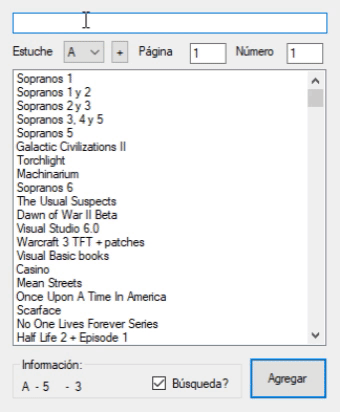

## DiscAdmin

DiscAdmin is a physical media management application. I wrote this during my undergrad to help me
organize my CD and DVD collection. It's basically record keeping for my CD cases and everything inside.
It was also an excuse to teach myself SQLite.

Written in C# using WinForms, .NET 3.5 and SQLite. Demo:

# Building the project
- Clone the repo: git clone https://github.com/gpuma/disc-admin
- Open `DiscAdmin.sln` on Visual Studio (Tested on VS2017 Community)
- Install Nuget packages: `nuget install packages.config`
- Ready to go